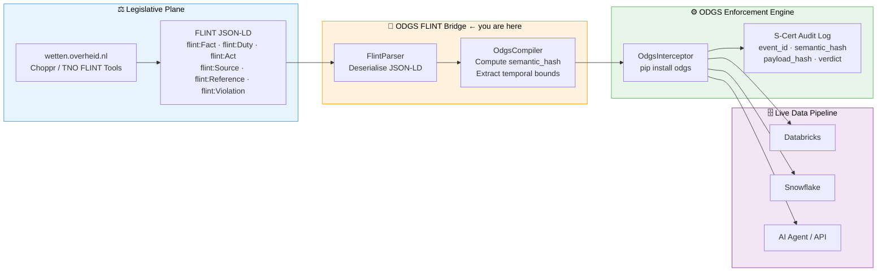

# ODGS FLINT Bridge

[](https://opensource.org/licenses/Apache-2.0)
[](https://github.com/MetricProvenance/odgs-protocol)
[](https://pypi.org/project/odgs-flint-bridge/)
[](https://www.python.org/)

The **ODGS FLINT Bridge** is an open-source institutional connector that translates **TNO FLINT** (Formal Language for the Interpretation of Normative Texts) Linked Data into **ODGS Executable Enforcement Rules**.

It bridges the semantic legal ontology layer with the ODGS enforcement engine — connecting "Rules as Code" (Regels als Code) ecosystems to live data pipelines.

---

## Install

```bash
pip install odgs-flint-bridge
```

---

## CLI

After install, the `odgs-flint` command is available:

```bash
# Compile a FLINT JSON-LD file and print the rule
odgs-flint sample_flint.json

# Compile and save to a file
odgs-flint sample_flint.json --output my_rule.json

# Compact output (no indentation)
odgs-flint sample_flint.json --compact
```

On file save, the CLI prints a summary:
```
Rule written to my_rule.json
  semantic_hash:  a3f8c2d1...
  urn:            urn:odgs:rule:flint:zorgtoeslag_art5_p1
  effective_from: 2026-01-01   (if declared in flint:period)
```

---

## Python API

```python
from odgs_flint_bridge.parser import FlintParser
from odgs_flint_bridge.compiler import OdgsCompiler

# Load your FLINT JSON-LD payload
flint_payload = {
    "@type": "flint:Fact",
    "flint:identifier": "urn:flint:fact:zorgtoeslag:art5:p1",
    "flint:name": "Zorgtoeslag Threshold",
    "flint:sourceReference": "https://wetten.overheid.nl/BWBR0018988/",
    "flint:expression": {
        "flint:subject": "inkomen",
        "flint:operator": "LESS_THAN_OR_EQUAL",
        "flint:targetValue": 35000
    }
}

# Parse → Compile  (FlintParser.parse() auto-routes by @type)
parsed = FlintParser.parse(flint_payload)
rule = OdgsCompiler.compile_rule(parsed)

print(rule["semantic_hash"])  # SHA-256 of the source FLINT JSON-LD
print(rule["urn"])             # urn:odgs:rule:flint:zorgtoeslag_art5_p1
```

The compiled rule is ready to load directly into the ODGS enforcement engine:

```python
from odgs.executive.interceptor import OdgsInterceptor

engine = OdgsInterceptor(rules=[rule])
engine.intercept("urn:odgs:custom:myprocess", {"inkomen": 40000})
```

---

## What It Does

1. **Parses all six FLINT types** — `flint:Fact`, `flint:Duty`, `flint:Act`, `flint:Source`, `flint:Reference`, `flint:Violation` from any TNO FLINT source (wetten.overheid.nl, Choppr, EUR-Lex, etc.)
2. **Computes `semantic_hash`** — Auto-generates a SHA-256 of the verbatim source payload, logged on every enforcement event — a tamper-evident link from decision back to law.
3. **Extracts rule lifecycle** — `flint:Duty` payloads with a `flint:period` produce `effective_from`/`effective_to` bounds, enforced by the ODGS engine.
4. **Type-specific rule shapes** — Each FLINT type compiles to the right ODGS severity: `HARD_STOP` for facts/duties/violations, `ACT_CONSTRAINT` for acts, `METADATA_ONLY` for sources, `LOG_ONLY` for references.
5. **Human-readable audit fields** — `plain_english_description` (from `flint:description`) and `non_conformance_message` (from `flint:salvageClause`) surface directly in S-Cert audit logs.

---

## The Architecture



---

## Enterprise

This package emits rules with `semantic_hash: "auto-computed"` — the SHA-256 is derived locally from the source payload. For **Registry-attested hashing** with sovereign Ed25519 signing (required for EU AI Act liability indemnification), upgrade to the Metric Provenance enterprise tier.

👉 **[Sovereign Registry & Enterprise Law Packs](https://platform.metricprovenance.com)**

---

Licensed under the [Apache License 2.0](https://opensource.org/licenses/Apache-2.0).
